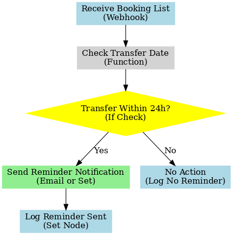

# Customer Booking Reminder Bot (n8n Workflow)

> **Project Pitch:**  
> I built a simple n8n workflow that monitors upcoming customer transfers and automatically sends reminders if the booking is within the next 24 hours.  
> This workflow helps improve customer communication, reduce missed pickups, and optimize operational efficiency.

---

## System Diagram

---

## What it Does
- Receives a list of bookings with transfer dates
- Checks if any booking is scheduled within the next 24 hours
- Sends an automated reminder notification for upcoming bookings
- Logs reminder actions for future reference

---

## Technologies Used
- **n8n** (workflow automation)
- **Webhook Node** (input trigger)
- **DateTime Comparison (Function Node)** (to calculate 24-hour windows)
- **Email Node** or **Set Node** (simulate reminder sending)
- **Set Node** (logging)

---

## Files
- **customer-booking-reminder-workflow.json** — Exported n8n workflow file
- **customer-booking-reminder-diagram.png** — Visual system diagram

---

## Future Work

- Add support for SMS and push notification reminders
- Pull customer preferences from CRM for personalized timing
- Log missed pickups and retry logic
- Integrate with multilingual templates for broader customer support

---
*Demo built for AI Agent Implementation Manager portfolio presentation.*
